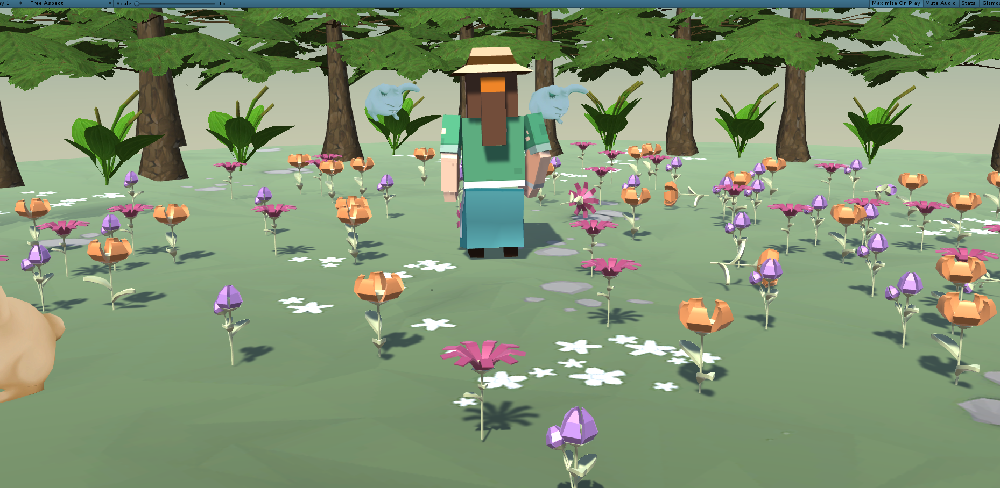
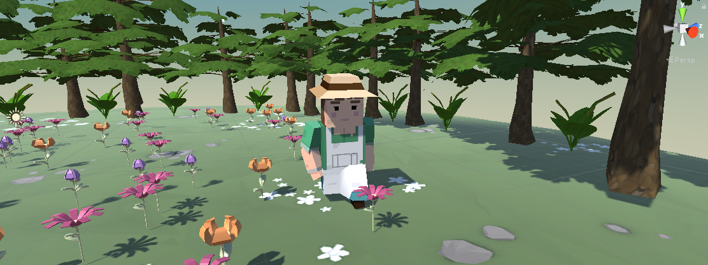

# Unity Game Development

My personal project this year is to create a small computer game using Unity. Having gone through the **Junior Programmer** tutorials offered by Unity, I've learned the basics of C# programming in Unity to start creating my own game.

The idea so far is a game where the main character is to collect *flowers*. I want the look and feel of the game to be bright and happy with simple game play for now. After developing the basic gameplay, I hope to try and create my own assets!

## To Do
- [x] camera control
- [x] player control
- [x] flower and rabbit spawning
- [x] flower contiously spawns randomly, and now they won't spawn on top of each other
- [x] flower death by rabbit
- [ ] update player physics and interactions with other objects
    - [ ] what happens to flowers when player passes through
    - [x] player picking up flowers
    - [ ] animation of flower picking
- [ ] animation for flower growing and dying
- [ ] user gui for collection of flowers
- [ ] refactoring
- [ ] graphics
- [ ] surrounding environment
- [ ] gameplay
    - [ ] player defense, attack, etc

Player crouching to pick up a flower

## Assets being used
- [Rabbits](https://assetstore.unity.com/packages/3d/characters/creatures/level-1-monster-pack-77703)
- [Flowers](https://assetstore.unity.com/packages/3d/vegetation/plants/lowpoly-flowers-47083)
- [Player](https://assetstore.unity.com/packages/templates/tutorials/create-with-code-prototype-2-feed-the-animals-146037)
- [Setting](https://assetstore.unity.com/packages/3d/simple-sky-cartoon-assets-42373)
- [Nature](https://assetstore.unity.com/packages/3d/environments/hand-painted-nature-kit-lite-69220)

